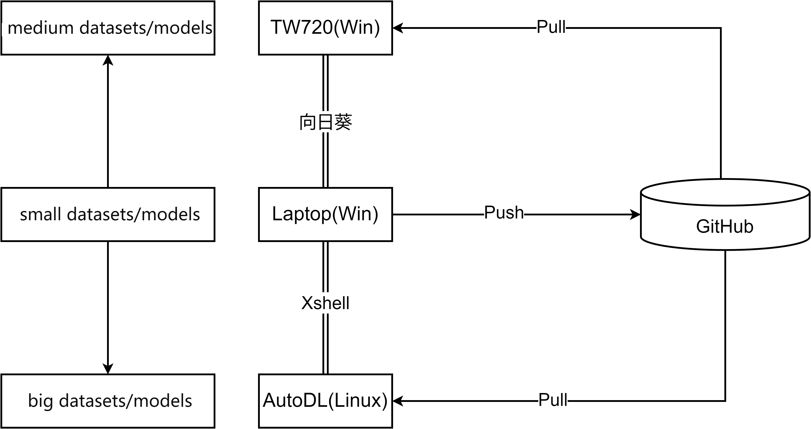

## 论文写作参考

### 实验

#### 模型编写

主要用Pycharm，尽量从Github导入经典模型或者一些常用的库

[RecBole](https://recbole.io/) : 常用推荐系统库

[NCL](https://github.com/RUCAIBox/NCL) : 我在这个模型上面改的

[GS-GCL](https://github.com/big-maomi/GS-GCL) :  我的论文相关代码

#### 模型训练

##### 资源清单



我们一共有如下几个方面的计算资源：

1. 本机资源  Laptop（Win）
2. 实验室资源  TW720（Win）
3. 云端资源  AutoDL（Linux）
4. 学院资源和公司资源，这里不再赘述，大家找到了可以放到这里

##### 版本管理

用GitHub，修改之后就推上去，相当于云端也备份了一份，出现问题也能回退

```shell
# 主要命令
# 推到GitHub上 Laptop
git add .
git commit -m "modify ...."
git push
# 拉下来 TW720/AutoDL
git clone
git pull
```

##### 训练流程

1. 在Laptop上开发程序（python）和脚本（shell/powershell），push到GitHub上，通过向日葵和Xshell远程连接到TW720或者AutoDL，将模型和脚本从GitHub上pull下来进行训练，以此来保证三者代码版本是一致的
2. 先在Laptop上跑小一点的数据集/模型，调好了再TW720和AutoDL跑耗时时间长的数据集和模型，着急可以三个资源并行

> 建议：读写分离，保证版本一致。不要在TW720和AutoDL上改代码，Laptop负责写，TW720和AutoDL负责读！

##### 脚本写作

首先，需要修改 main 函数以使其能接受自定义参数。

```python
def run_single_model(args):
    # Initialize configuration from given arguments
    config = Config(
        model=GS_GCL,
        dataset=args.dataset,
        config_file_list=args.config_file_list
    )
    # Configure the loss type and training parameters based on arguments
    config['loss_type'] = args.loss_type
    config['train_type'] = []

    if config['loss_type'] != 2:
        config['train_type'].append('loss_type')
    .......
    if args.epochs is not None:
        config['epochs'] = args.epochs
        config['train_type'].append('epochs')

    if args.proto_reg is not None:
        config['proto_reg'] = float(args.proto_reg)
        config['train_type'].append('proto_reg')

```

随后，就可以愉快地写脚本了

```powershell
# laptop上可以下载一个powershell，比cmd好用  shell脚本大家应该都会写
# Win powershell脚本，该脚本可以指定数据集和参数，这样方便做对比试验、消融实验和超参分析
conda activate RecBole
# 消融实验
python main.py --dataset gowalla-merged --loss_type 0
python main.py --dataset gowalla-merged --loss_type 1
python main.py --dataset gowalla-merged --loss_type 2
# 超参分析
python main.py --dataset ml-1m --alpha 0.1
python main.py --dataset ml-1m --alpha 0.3
python main.py --dataset ml-1m --alpha 0.5
```

RecBole库训练完了会自动存log，格式如下

```shell
Wed 24 Apr 2024 13:33:34 INFO  
General Hyper Parameters:
gpu_id = 0
use_gpu = True
seed = 2020
state = INFO
..........
Wed 24 Apr 2024 15:58:45 INFO  epoch 139 training [time: 59.78s, train_loss1: 18.7641, train_loss2: 0.7052, train_loss3: 0.5157]
Wed 24 Apr 2024 15:58:45 INFO  epoch 139 evaluating [time: 0.32s, valid_score: 0.219400]
Wed 24 Apr 2024 15:58:45 INFO  valid result: 
recall@10 : 0.1804    recall@20 : 0.275    recall@50 : 0.4463    ndcg@10 : 0.2194    ndcg@20 : 0.2394    ndcg@50 : 0.2931
Wed 24 Apr 2024 15:58:45 INFO  Finished training, best eval result in epoch 128
Wed 24 Apr 2024 15:58:45 INFO  Loading model structure and parameters from saved\GS_GCL-ml-1m-ordinary-Apr-24-2024_13-40-34-06e365.pth
Wed 24 Apr 2024 15:58:45 INFO  best valid : OrderedDict([('recall@10', 0.1812), ('recall@20', 0.2749), ('recall@50', 0.4467), ('ndcg@10', 0.2204), ('ndcg@20', 0.2399), ('ndcg@50', 0.2937)])
# 这里就是我们需要的结果
Wed 24 Apr 2024 15:58:45 INFO  test result: OrderedDict([('recall@10', 0.2072), ('recall@20', 0.3074), ('recall@50', 0.4752), ('ndcg@10', 0.2733), ('ndcg@20', 0.2857), ('ndcg@50', 0.3326)])
```

大家尽量找到别人做好的库和模型，在上面做一些改进，在别人的地基上造房子要更快一些，不给代码/代码跑不通的论文直接丢垃圾桶。

### 论文

#### 论文写作

1. 尽量用word，wps问题比较多；也可以先用typora写完再统一调格式
2. 迅捷OCR文字识别，很好用
3. 复制的文本有换行符的话可以粘贴到浏览器搜索栏，再复制一次就没有了

#### 论文润色

1. chatGPT Plus，可以让他看看有没有错别字和病句，还可以帮你润色，但是润色后可能与原意就不太一样了，而且有太多转折词，还需要再改一改
2. paperyy有个纠错功能，主要是识别错别字和重复
3. 摘要总结好好写一写，需要重点润色

#### 论文管理

Github来管理版本，记得及时保存备份（网盘、U盘、微信），和代码差不多管理

#### 论文查重

直接[知网](https://mp.weixin.qq.com/s/ODsoLRUeNzbFHDt503zuWw )查重就行，可以下载中国知网APP，也能用

> 有假冒知网，一定注意

### 图表、公式、参考文献

#### 画图

1. draw.io ：画流程图和示意图
2. python + chatGPT（可生成代码，然后改细节）：画柱状图、折线图等
3. [配色参考](https://zhuanlan.zhihu.com/p/621445823)：颜值就是生产力

#### 公式

1. word自带：建议大家用这个
2. Mathtype：想找麻烦用这个

> 需注意全文格式一致，有斜体都要斜体

#### 参考文献

1. EndNote ：用来管理文献，插入引用，[安装使用教程](https://www.bilibili.com/video/BV1eX4y1C7tZ?vd_source=3251be8fbb32afa16c31cf754d884c81 )
2. [Google Scholar](https://scholar.google.com/ ) ：下载EndNote格式的参考文献，导入EndNote，之后就能引用了

## 资料获取

DHU往届论文：https://xwlwtj.dhu.edu.cn/index.action

其他学校：中国知网


